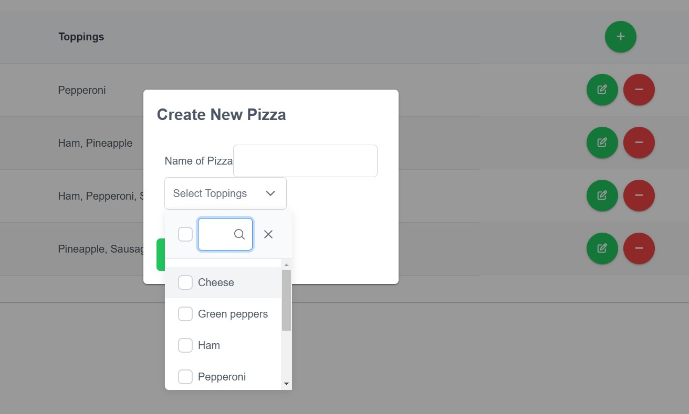
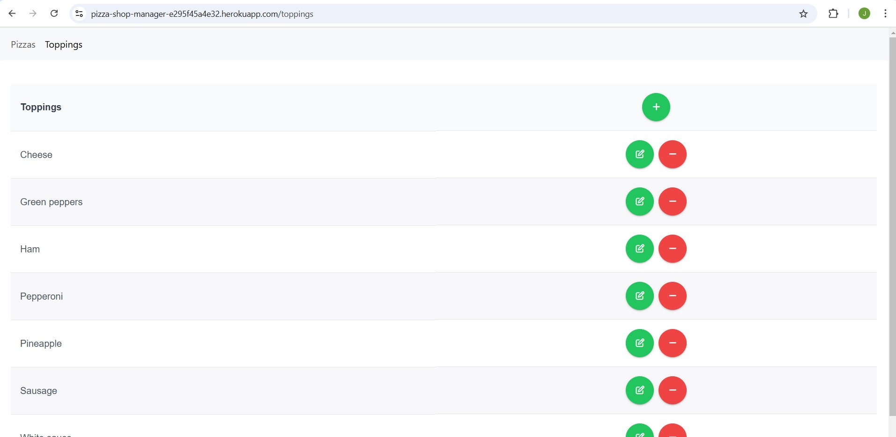
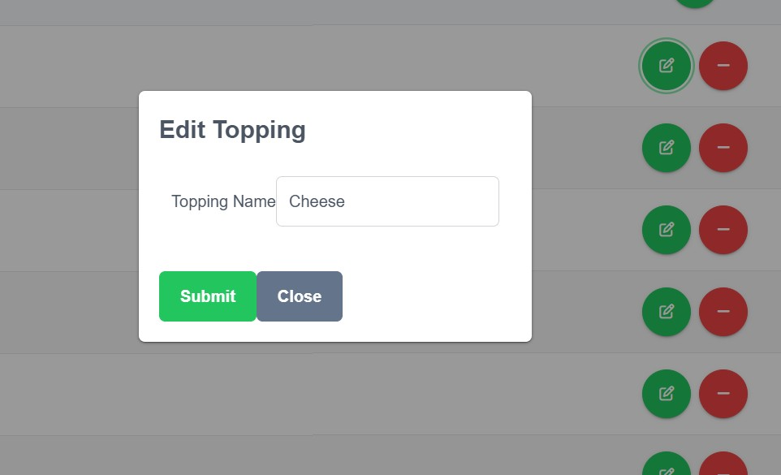

# Pizza Shop Manager

---

## **Table of Contents**

- [Description](#Description)

- [Usage](#usage)

- [Screenshots](#screenshots)

- [Technology](#technology)

- [Contribution](#contribution)

- [Extras](#extras)

- [Questions](#questions)

---

## **Description**

An application that allows the user to manage a pizza shop menu. In it, they are able to view a list of their available pizza toppings, add new toppings, edit existing toppings, and also delete any toppings the user no longer uses. Once there are toppings availale, the user can then create pizzas from the available toppings. There are no limits to how many toppings they can add, other than they will not be able to duplicate any toppings on the pizza. In the pizza section, they will be able to view all the available pizzas created, add a new pizza, edit any of the current pizzas by changing their name or updating their toppings, or even delete any pizza they no longer want to offer. There are fail safes when creating and editing the toppings and pizzas that will prevent the user from adding/editing toppings with the same name and adding/editing pizzas with the same name or toppings offerings.

The application uses the Angular framework as the frontend as this allows for compartmentalizing the different components, toppings and pizzas, that will allow for easier reusability in the application and a separation of concerns when debugging. Choosing to use MongoDB as the database allowed for a low cost online database that is not saved on my local server/computer. The combination of Bootstrap and PrimeNg allowed quicker styling of the frontend for the user.

---

## **Usage**

See the deployed version here through Heroku! [Deployed link](https://pizza-shop-manager-e295f45a4e32.herokuapp.com/)

To run the application locally, perform the following steps after.

- Clone the repository from https://github.com/JMan4342/Pizza_Shop_Manager and open in your preferred code editor.
- Open your terminal.
- cd to the root folder (../Pizza_Shop_Manager) and enter npm install to ensure you have all the dependencies installed to run the server backend.
- cd to the client folder (../Pizza_Shop_Manager/client) and enter the npm install to ensure you have all the dependencies installed for the client side.
- To run the backend server, cd to the server folder (../server) and enter node server.js, or you can run the command node server/server.js from the root folder.
- To start the application, cd to the client folder (../client) and enter ng serve.

There are no tests installed for the application.

---

## **Screenshots**

Below are images of my completed Pizza Shop Manager application.

---

## **Technology**

- Angular
- MongoDB
- Typescript
- npm
- Node.js
- Bootstrap
- PrimeNg

---

## **Contribution**

If you are looking to contribute the Pizza Shop Manager app, you can find its repo at https://github.com/JMan4342/Pizza_Shop_Manager.

---

## **Extras**

To view the same application but with a local SQL backend, you can find the repo at https://github.com/JMan4342/Pizza_Shop. This application is not deployed to production.

---

## **Questions**

If you have any questions, please feel free to reach out to me at manning.joseph.4342@gmail.com.
